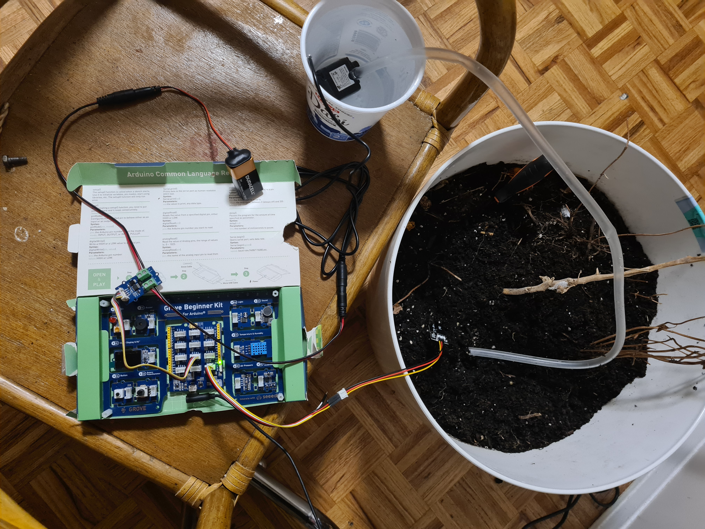

# Automatic Plant Watering System

This project implements an automatic plant watering system using an Arduino board, a moisture sensor, and a water pump. The system is controlled by a Java program that runs on a state machine, ensuring the plant is watered only when necessary based on the soil's moisture level.

## Table of Contents
- [Introduction](#introduction)
- [Components](#components)
- [How It Works](#how-it-works)
- [Setup](#setup)
- [Code Overview](#code-overview)
- [Results](#results)
- [Future Improvements](#future-improvements)
- [Video Demonstration](#video-demonstration)

## Introduction
The automatic plant watering system is designed to efficiently water plants without human intervention. It uses a moisture sensor to detect the soil's moisture level and a water pump to deliver water when the soil is dry. The system is controlled by a Java program that runs on an Arduino board, utilizing the `TimerTask` and `Firmata4j` libraries.

## Components
- **Laptop**: Runs the Java program on IntelliJ.
- **Arduino Board**: Connects the pump and sensor, handling data input/output.
- **Pump**: Delivers water to the soil.
- **Battery**: Powers the pump.
- **MOSFET**: Connects the battery and pump to the Arduino board.
- **Moisture Sensor**: Measures the soil's moisture level and sends voltage data to the Java program.

## How It Works
The system operates as a state machine with three states:
1. **Dry Soil State**: If the soil is too dry, the pump turns on to water the plant.
2. **Slightly Dry Soil State**: If the soil is a bit dry, the pump continues to water the plant.
3. **Wet Soil State**: If the soil is wet, the pump turns off.

The state machine checks the soil's moisture level every second and adjusts the pump's operation accordingly.

## Setup
1. **Hardware Setup**:
   - Connect the moisture sensor and water pump to the Arduino board.
   - Power the pump using a battery connected through a MOSFET.
   - Ensure the Arduino board is connected to your laptop via USB.

2. **Software Setup**:
   - Install IntelliJ IDEA and set up a Java project.
   - Add the `Firmata4j` library to your project.
   - Upload the Arduino Firmata sketch to the Arduino board.

3. **Running the Program**:
   - Clone this repository.
   - Open the project in IntelliJ.
   - Run the `Minor_Project` class to start the system.

## Code Overview
The Java program consists of two main classes:
- **TimerMinor**: Implements the state machine logic using `TimerTask`. It checks the soil's moisture level and controls the pump based on predefined voltage thresholds.
- **Minor_Project**: Initializes the Arduino board and starts the `TimerMinor` task.

### Key Variables
- **reallyDryValue**: Voltage threshold for dry soil.
- **moistureThreshold**: Voltage threshold for slightly dry soil.
- **saturatedValue**: Voltage threshold for wet soil.
- **red, yellow, green**: Timing intervals for the state machine.

## Results
The system successfully waters the plant based on the soil's moisture level. When the moisture sensor detects dry soil, the pump turns on and waters the plant. Once the soil reaches the desired moisture level, the pump turns off.

## Future Improvements
- **Enhanced Moisture Sensing**: Implement more advanced moisture sensing techniques for better accuracy.
- **Remote Monitoring**: Add a feature to monitor the system remotely via a mobile app or web interface.
- **Energy Efficiency**: Optimize the system for lower power consumption, especially for battery-powered setups.

## Video Demonstration
Watch the project in action on YouTube: [Automatic Plant Watering System](https://youtu.be/3PgA5tyXjhw)

---

Feel free to contribute to this project by submitting issues or pull requests. For any questions, please contact the project author.

**Author**: Mohammad Zain Al Syed  
**Student ID**: 218394684  
**Date**: April 13th, 2022
